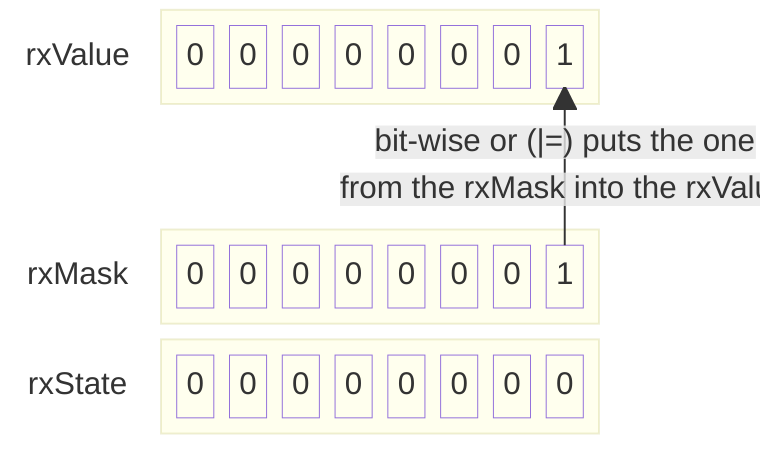
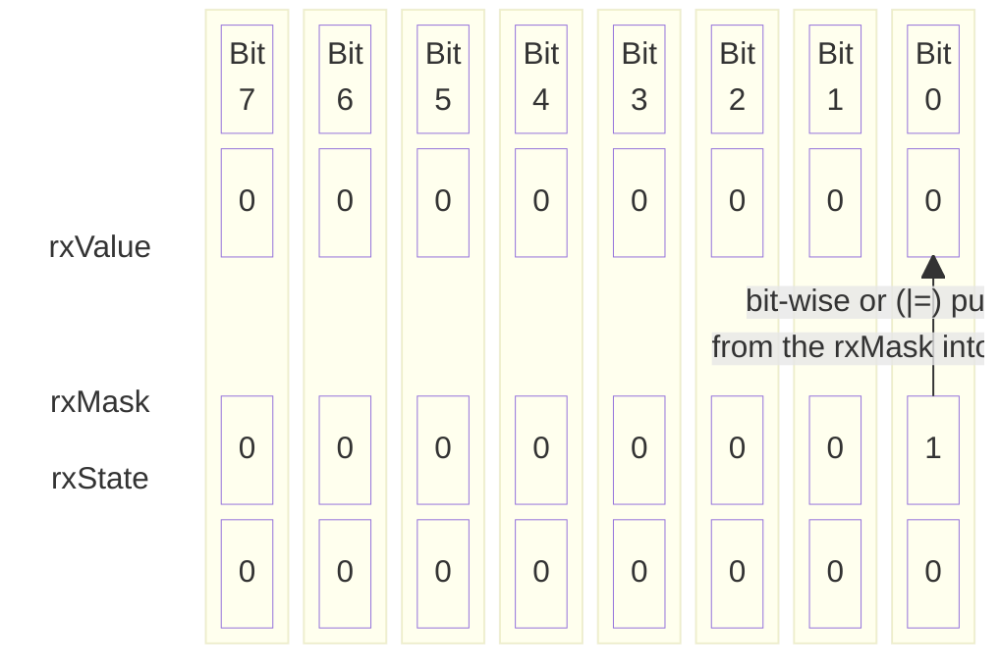
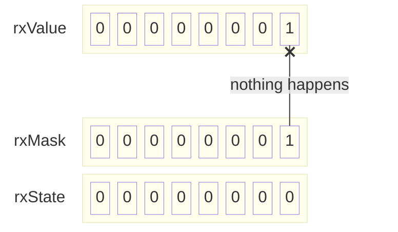
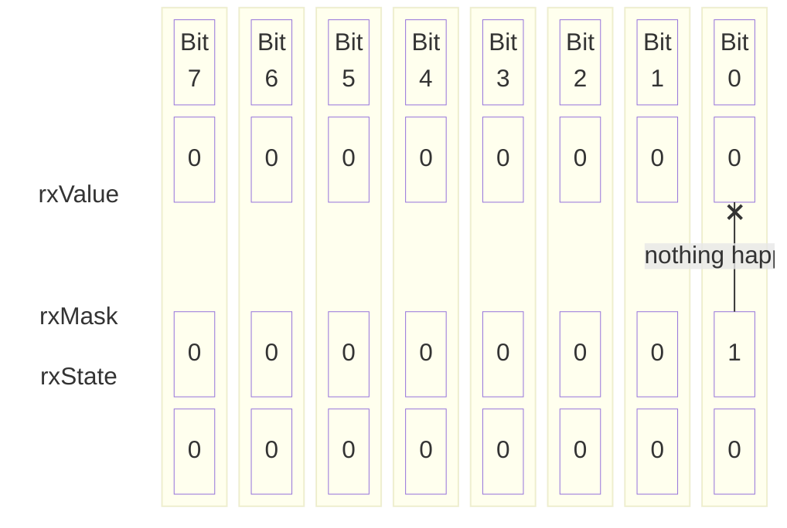
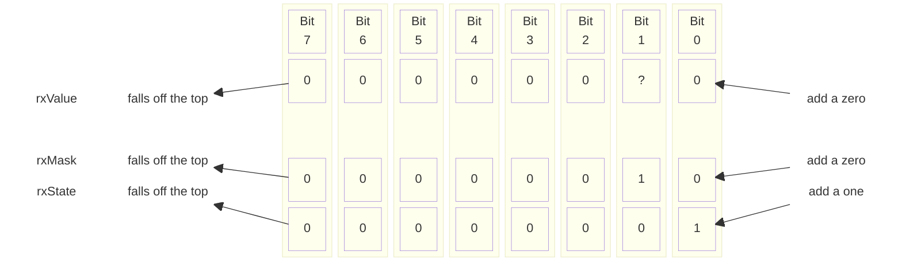
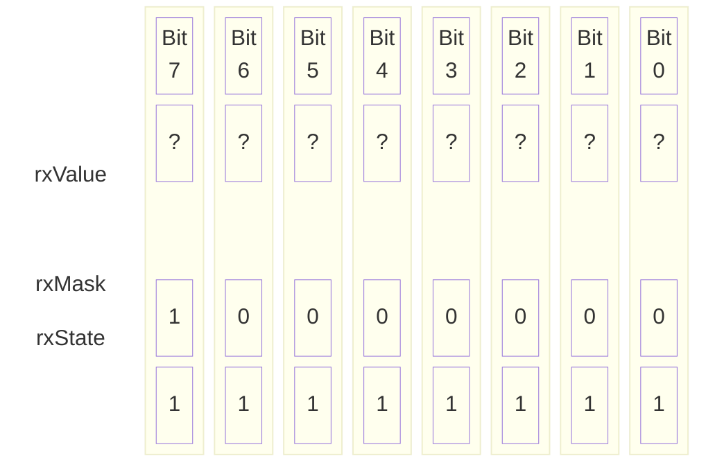

```mermaid
block-beta
columns 5
  rxValue
  block:rxValueBits:3
    rxValue7["0"] rxValue6["0"] rxValue5["0"] rxValue4["0"] rxValue3["0"] rxValue2["0"] rxValue1["0"] rxValue0["1"]
  end
  space:6
  rxMask
  block:rxMaskBits:3
    rxMask7["0"] rxMask6["0"] rxMask5["0"] rxMask4["0"] rxMask3["0"] rxMask2["0"] rxMask1["0"] rxMask0["1"]
  end
  space:1
  rxState
  block:rxStateBits:3
    rxState7["0"] rxState6["0"] rxState5["0"] rxState4["0"] rxState3["0"] rxState2["0"] rxState1["0"] rxState0["0"]
  end
  space:1
  rxMask0-- "bit-wise or (|=) puts the one \nfrom the rxMask into the rxValue" -->rxValue0

classDef labels stroke:None,fill:None
class rxValue,rxMask,rxState labels

classDef bits stroke-width:0.5,fill:None
class rxValue7,rxValue6,rxValue5,rxValue4,rxValue3,rxValue2,rxValue1,rxValue0 bits
class rxMask7,rxMask6,rxMask5,rxMask4,rxMask3,rxMask2,rxMask1,rxMask0 bits
class rxState7,rxState6,rxState5,rxState4,rxState3,rxState2,rxState1,rxState0 bits
```

```mermaid
block-beta
  block:labels:2
    columns 1
    space
    rxValue
    space
    rxMask
    rxState
  end
    block:bit7
        columns 1
        bitLabel7["Bit\n7"]
        rxValue7["0"]
        space
        rxMask7["0"]
        rxState7["0"]
    end
    block:bit6
        columns 1
        bitLabel6["Bit\n6"]
        rxValue6["0"]
        space
        rxMask6["0"]
        rxState6["0"]
    end
    block:bit5
        columns 1
        bitLabel5["Bit\n5"]
        rxValue5["0"]
        space
        rxMask5["0"]
        rxState5["0"]
    end
    block:bit4
        columns 1
        bitLabel4["Bit\n4"]
        rxValue4["0"]
        space
        rxMask4["0"]
        rxState4["0"]
    end
    block:bit3
        columns 1
        bitLabel3["Bit\n3"]
        rxValue3["0"]
        space
        rxMask3["0"]
        rxState3["0"]
    end
    block:bit2
        columns 1
        bitLabel2["Bit\n2"]
        rxValue2["0"]
        space
        rxMask2["0"]
        rxState2["0"]
    end
    block:bit1
        columns 1
        bitLabel1["Bit\n1"]
        rxValue1["0"]
        space
        rxMask1["0"]
        rxState1["0"]
    end
    block:bit0
        columns 1
        bitLabel0["Bit\n0"]
        rxValue0["0"]
        space
        rxMask0["1"]
        rxState0["0"]
    end
  rxMask0-- "bit-wise or (|=) puts the one \nfrom the rxMask into the rxValue" -->rxValue0

classDef outerLabels stroke:None,fill:None
class labels,actionTop,actionBottom outerLabels
classDef innerLabels stroke:None,fill:None
class rxValue,rxMask,rxState innerLabels
classDef innerActions stroke:None,fill:None
class rxValueActionTop,rxValueActionBottom,rxMaskActionTop,rxMaskActionBottom,rxStateActionTop,rxStateActionBottom innerActions

classDef bitLabels stroke-width:0.5,fill:None
class bitLabel7,bitLabel6,bitLabel5,bitLabel4,bitLabel3,bitLabel2,bitLabel1,bitLabel0 bitLabels

classDef bits stroke-width:0.5,fill:None
class rxValue7,rxValue6,rxValue5,rxValue4,rxValue3,rxValue2,rxValue1,rxValue0 bits
class rxMask7,rxMask6,rxMask5,rxMask4,rxMask3,rxMask2,rxMask1,rxMask0 bits
class rxState7,rxState6,rxState5,rxState4,rxState3,rxState2,rxState1,rxState0 bits
```

```mermaid
block-beta
columns 5
  rxValue
  block:rxValueBits:3
    rxValue7["0"] rxValue6["0"] rxValue5["0"] rxValue4["0"] rxValue3["0"] rxValue2["0"] rxValue1["0"] rxValue0["1"]
  end
  space:6
  rxMask
  block:rxMaskBits:3
    rxMask7["0"] rxMask6["0"] rxMask5["0"] rxMask4["0"] rxMask3["0"] rxMask2["0"] rxMask1["0"] rxMask0["1"]
  end
  space:1
  rxState
  block:rxStateBits:3
    rxState7["0"] rxState6["0"] rxState5["0"] rxState4["0"] rxState3["0"] rxState2["0"] rxState1["0"] rxState0["0"]
  end
  space:1
  rxMask0-- "nothing happens" --xrxValue0

classDef labels stroke:None,fill:None
class rxValue,rxMask,rxState labels

classDef bits stroke-width:0.5,fill:None
class rxValue7,rxValue6,rxValue5,rxValue4,rxValue3,rxValue2,rxValue1,rxValue0 bits
class rxMask7,rxMask6,rxMask5,rxMask4,rxMask3,rxMask2,rxMask1,rxMask0 bits
class rxState7,rxState6,rxState5,rxState4,rxState3,rxState2,rxState1,rxState0 bits
```

```mermaid
block-beta
  block:labels:2
    columns 1
    space
    rxValue
    space
    rxMask
    rxState
  end
    block:bit7
        columns 1
        bitLabel7["Bit\n7"]
        rxValue7["0"]
        space
        rxMask7["0"]
        rxState7["0"]
    end
    block:bit6
        columns 1
        bitLabel6["Bit\n6"]
        rxValue6["0"]
        space
        rxMask6["0"]
        rxState6["0"]
    end
    block:bit5
        columns 1
        bitLabel5["Bit\n5"]
        rxValue5["0"]
        space
        rxMask5["0"]
        rxState5["0"]
    end
    block:bit4
        columns 1
        bitLabel4["Bit\n4"]
        rxValue4["0"]
        space
        rxMask4["0"]
        rxState4["0"]
    end
    block:bit3
        columns 1
        bitLabel3["Bit\n3"]
        rxValue3["0"]
        space
        rxMask3["0"]
        rxState3["0"]
    end
    block:bit2
        columns 1
        bitLabel2["Bit\n2"]
        rxValue2["0"]
        space
        rxMask2["0"]
        rxState2["0"]
    end
    block:bit1
        columns 1
        bitLabel1["Bit\n1"]
        rxValue1["0"]
        space
        rxMask1["0"]
        rxState1["0"]
    end
    block:bit0
        columns 1
        bitLabel0["Bit\n0"]
        rxValue0["0"]
        space
        rxMask0["1"]
        rxState0["0"]
    end
  rxMask0-- "nothing happens" --xrxValue0

classDef outerLabels stroke:None,fill:None
class labels,actionTop,actionBottom outerLabels
classDef innerLabels stroke:None,fill:None
class rxValue,rxMask,rxState innerLabels
classDef innerActions stroke:None,fill:None
class rxValueActionTop,rxValueActionBottom,rxMaskActionTop,rxMaskActionBottom,rxStateActionTop,rxStateActionBottom innerActions

classDef bitLabels stroke-width:0.5,fill:None
class bitLabel7,bitLabel6,bitLabel5,bitLabel4,bitLabel3,bitLabel2,bitLabel1,bitLabel0 bitLabels

classDef bits stroke-width:0.5,fill:None
class rxValue7,rxValue6,rxValue5,rxValue4,rxValue3,rxValue2,rxValue1,rxValue0 bits
class rxMask7,rxMask6,rxMask5,rxMask4,rxMask3,rxMask2,rxMask1,rxMask0 bits
class rxState7,rxState6,rxState5,rxState4,rxState3,rxState2,rxState1,rxState0 bits
```

```mermaid
block-beta
  block:labels:2
    columns 1
    space
    rxValue
    space
    rxMask
    rxState
  end
  block:actionTop:2
    columns 1
    space
    rxValueActionTop["falls off the top"]
    space
    rxMaskActionTop["falls off the top"]
    rxStateActionTop["falls off the top"]
  end
  space
    block:bit7
        columns 1
        bitLabel7["Bit\n7"]
        rxValue7["0"]
        space
        rxMask7["0"]
        rxState7["0"]
    end
    block:bit6
        columns 1
        bitLabel6["Bit\n6"]
        rxValue6["0"]
        space
        rxMask6["0"]
        rxState6["0"]
    end
    block:bit5
        columns 1
        bitLabel5["Bit\n5"]
        rxValue5["0"]
        space
        rxMask5["0"]
        rxState5["0"]
    end
    block:bit4
        columns 1
        bitLabel4["Bit\n4"]
        rxValue4["0"]
        space
        rxMask4["0"]
        rxState4["0"]
    end
    block:bit3
        columns 1
        bitLabel3["Bit\n3"]
        rxValue3["0"]
        space
        rxMask3["0"]
        rxState3["0"]
    end
    block:bit2
        columns 1
        bitLabel2["Bit\n2"]
        rxValue2["0"]
        space
        rxMask2["0"]
        rxState2["0"]
    end
    block:bit1
        columns 1
        bitLabel1["Bit\n1"]
        rxValue1["?"]
        space
        rxMask1["1"]
        rxState1["0"]
    end
    block:bit0
        columns 1
        bitLabel0["Bit\n0"]
        rxValue0["0"]
        space
        rxMask0["0"]
        rxState0["1"]
    end
  space
  block:actionBottom:2
    columns 1
    space
    rxValueActionBottom["add a zero"]
    space
    rxMaskActionBottom["add a zero"]
    rxStateActionBottom["add a one"]
  end
  rxValue7-->rxValueActionTop
  rxMask7-->rxMaskActionTop
  rxState7-->rxStateActionTop
  rxValueActionBottom-->rxValue0
  rxMaskActionBottom-->rxMask0
  rxStateActionBottom-->rxState0

classDef outerLabels stroke:None,fill:None
class labels,actionTop,actionBottom outerLabels
classDef innerLabels stroke:None,fill:None
class rxValue,rxMask,rxState innerLabels
classDef innerActions stroke:None,fill:None
class rxValueActionTop,rxValueActionBottom,rxMaskActionTop,rxMaskActionBottom,rxStateActionTop,rxStateActionBottom innerActions

classDef bitLabels stroke-width:0.5,fill:None
class bitLabel7,bitLabel6,bitLabel5,bitLabel4,bitLabel3,bitLabel2,bitLabel1,bitLabel0 bitLabels

classDef bits stroke-width:0.5,fill:None
class rxValue7,rxValue6,rxValue5,rxValue4,rxValue3,rxValue2,rxValue1,rxValue0 bits
class rxMask7,rxMask6,rxMask5,rxMask4,rxMask3,rxMask2,rxMask1,rxMask0 bits
class rxState7,rxState6,rxState5,rxState4,rxState3,rxState2,rxState1,rxState0 bits
```

```mermaid
block-beta
  block:labels:2
    columns 1
    space
    rxValue
    space
    rxMask
    rxState
  end
    block:bit7
        columns 1
        bitLabel7["Bit\n7"]
        rxValue7["?"]
        space
        rxMask7["1"]
        rxState7["1"]
    end
    block:bit6
        columns 1
        bitLabel6["Bit\n6"]
        rxValue6["?"]
        space
        rxMask6["0"]
        rxState6["1"]
    end
    block:bit5
        columns 1
        bitLabel5["Bit\n5"]
        rxValue5["?"]
        space
        rxMask5["0"]
        rxState5["1"]
    end
    block:bit4
        columns 1
        bitLabel4["Bit\n4"]
        rxValue4["?"]
        space
        rxMask4["0"]
        rxState4["1"]
    end
    block:bit3
        columns 1
        bitLabel3["Bit\n3"]
        rxValue3["?"]
        space
        rxMask3["0"]
        rxState3["1"]
    end
    block:bit2
        columns 1
        bitLabel2["Bit\n2"]
        rxValue2["?"]
        space
        rxMask2["0"]
        rxState2["1"]
    end
    block:bit1
        columns 1
        bitLabel1["Bit\n1"]
        rxValue1["?"]
        space
        rxMask1["0"]
        rxState1["1"]
    end
    block:bit0
        columns 1
        bitLabel0["Bit\n0"]
        rxValue0["?"]
        space
        rxMask0["0"]
        rxState0["1"]
    end

classDef outerLabels stroke:None,fill:None
class labels,actionTop,actionBottom outerLabels
classDef innerLabels stroke:None,fill:None
class rxValue,rxMask,rxState innerLabels
classDef innerActions stroke:None,fill:None
class rxValueActionTop,rxValueActionBottom,rxMaskActionTop,rxMaskActionBottom,rxStateActionTop,rxStateActionBottom innerActions

classDef bitLabels stroke-width:0.5,fill:None
class bitLabel7,bitLabel6,bitLabel5,bitLabel4,bitLabel3,bitLabel2,bitLabel1,bitLabel0 bitLabels

classDef bits stroke-width:0.5,fill:None
class rxValue7,rxValue6,rxValue5,rxValue4,rxValue3,rxValue2,rxValue1,rxValue0 bits
class rxMask7,rxMask6,rxMask5,rxMask4,rxMask3,rxMask2,rxMask1,rxMask0 bits
class rxState7,rxState6,rxState5,rxState4,rxState3,rxState2,rxState1,rxState0 bits
```
